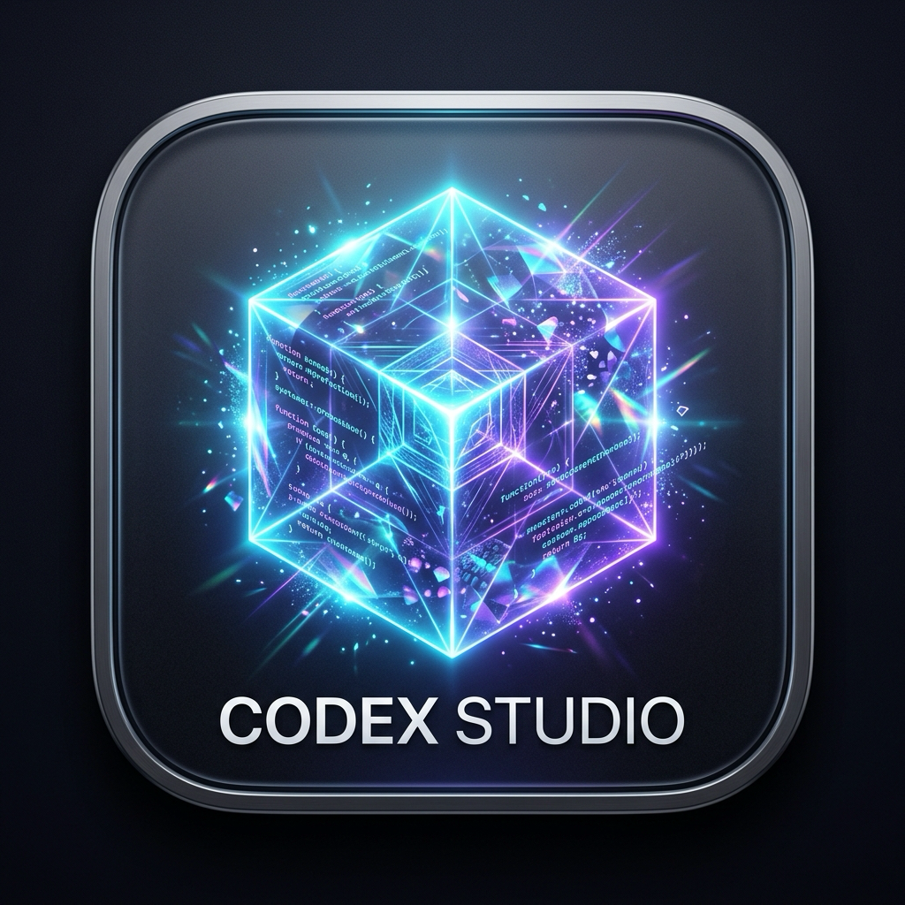

<div align="center">



# ⚡️ Codex Studio

**Supercharge ChatGPT Codex with Any Model & Infinite Credits — While Keeping 100% of Native Tools & Plugins.**

[-007AFF?style=for-the-badge&logo=apple&logoColor=white)](https://github.com/Veerhooda/Codex-Proxy/releases/latest/download/Codex.Studio-1.0.0-arm64.dmg)
[](https://github.com/Veerhooda/Codex-Proxy/releases/tag/v1.0.0)

[-black?style=for-the-badge&logo=apple)](https://apple.com)
[](https://nodejs.org)
[](https://python.org)
[](https://electronjs.org)
[](LICENSE)

<br/>

<p align="center">
  <b>Codex Custom Studio</b> is a standalone macOS application that lets you bypass ChatGPT account credit caps and run custom AI models (Claude 3.5/4.6, Claude Opus Thinking, Gemini 3.8 Flash, DeepSeek R1, OpenRouter, and Local Ollama) directly through ChatGPT Codex's native execution engine.
</p>

</div>

---

## 🌟 Why Codex Custom Studio?

| Traditional ChatGPT Desktop App | Codex Custom Studio |
| :--- | :--- |
| ❌ When monthly credits run out, the send button is disabled | ✅ **Infinite execution** via external providers, free local models, or Google OAuth |
| ❌ Locked to standard OpenAI model tiers | ✅ **Any model of your choice**: Claude Sonnet 4.6, Gemini 3.8 Flash, DeepSeek R1, Llama 3.3 |
| ❌ Third-party models cannot use Codex plugins in official app | ✅ **100% tool preservation**: `@computer`, `@chrome`, `@browser`, `@documents`, `@spreadsheets` |
| ❌ Cloud lock-in and vendor usage telemetry | ✅ **100% Local & Private**: All chats and keys stored strictly on your local disk |

---

## 🚀 Key Features

### 1. 🔑 Integrated Google Antigravity Bridge
- **1-Click Google OAuth (PKCE)**: Connect your Google Cloud Code account directly in the app.
- **Top-Tier Model Access**: Access `claude-sonnet-4-6`, `claude-opus-4-6-thinking`, `gemini-3.8-flash-tiered`, and `gemini-3-flash` without Vertex console setup.
- **Automated Protocol Translation**: Built-in translation handles Claude tool IDs, Gemini 3+ cryptographic `thoughtSignature` validation, and Google alternating turn requirements.

### 2. 🛠️ 100% Native macOS Plugin & Tool Support
Every custom model has full access to the official Codex plugin ecosystem:
- **`@computer`**: Direct macOS GUI control via Accessibility APIs (clicks, keyboard input, window inspection).
- **`@chrome` & `@browser`**: Web automation, research, and page interaction.
- **`@documents`, `@spreadsheets`, `@presentations`**: Native document and data creation.
- **`@code-review`, `@visualize`, `@pdf`**: Advanced workspace analysis tools.
- **Shell & Terminal Execution**: Sandboxed or full-access macOS terminal command runner.

### 3. 🖥️ Dual Mode: Native Desktop App or Web UI
- **Desktop Mode**: Sleek macOS Electron app with glassmorphic UI, live tool cards, timeline tracking, and thread history.
- **Web Mode**: Lightweight web dashboard running on `http://localhost:3737` for headless setups or browser tabs.

### 4. 🔒 Zero-Trust Local Security
- **No intermediary servers**: Prompts and responses stream directly between your Mac and your chosen provider.
- **Protected credentials**: Sensitive tokens and keys are stored with POSIX `0600` permissions in `~/.codex/` and never broadcast over the client API.

---

## 🏗️ Architecture

```
┌────────────────────────────────────────────────────────┐
│             Codex Custom Studio UI                     │
│         (Electron Desktop / Web Browser)               │
└──────────────────────────┬─────────────────────────────┘
                           │ WebSocket / REST (Port 3737)
                           v
┌────────────────────────────────────────────────────────┐
│             Express Server & Process Manager           │
│   - Thread History (SQLite)   - Model Configuration    │
│   - Provider Status Monitor   - Plugin Registry        │
└──────────────┬───────────────────────────┬─────────────┘
               │                           │
   Spawns Turn │                           │ Health / Status
               v                           v
┌──────────────────────────────┐ ┌───────────────────────┐
│     Codex CLI Engine         │ │  Antigravity Bridge   │
│       (codex.real)           │ │ (antigravity_bridge)  │
│  - MCP Plugin Orchestration  │ │  Port 8766 (Python)   │
│  - macOS CUA / Computer Use  │ └───────────┬───────────┘
│  - Shell Tool Execution      │             │
└──────────────┬───────────────┘             │ Google Cloud Code
               │                             │ (OAuth PKCE)
               │                             v
               │ Responses API   ┌───────────────────────┐
               └───────────────> │ Upstream Models       │
                                 │ - Claude Sonnet 4.6   │
                                 │ - Gemini 3.8 Flash    │
                                 │ - OpenRouter / Ollama │
                                 └───────────────────────┘
```

---

## ⚡️ Quick Start

### Prerequisites
1. **macOS** (Apple Silicon or Intel).
2. **Official ChatGPT macOS App** installed (provides the native `codex.real` binary and plugins).
3. **Node.js** (v18 or newer) & **Python 3**.

### Installation & Launch

```bash
# 1. Clone the repository
git clone https://github.com/Veerhooda/Codex-Proxy.git
cd Codex-Proxy

# 2. Launch the Native macOS Desktop App
./launch.sh
```

> **Tip**: To run in lightweight browser mode instead of the Electron window:
> ```bash
> ./launch.sh web
> ```
> *(Opens in your default browser at `http://localhost:3737`)*

---

## 🧩 Supported Providers

| Provider | Model Types | Setup |
| :--- | :--- | :--- |
| **Antigravity (Google)** | `claude-sonnet-4-6`, `claude-opus-4-6-thinking`, `gemini-3.8-flash-tiered`, `gemini-3-flash` | Click **Sign in with Google** in the app. Automatic OAuth PKCE with automatic token refresh. |
| **OpenRouter** | 200+ models (`anthropic/claude-3.5-sonnet`, `deepseek/deepseek-r1`, `meta-llama/llama-3.3-70b`) | Add `OPENROUTER_API_KEY` in settings. |
| **Meta Model API / Muse Spark** | `muse-spark-1.3-contributor`, `gpt-6-astra`, `gpt-5.6-sol` | Local bridge integration on port 8765. |
| **DeepSeek Official** | `deepseek-chat`, `deepseek-reasoner` | Add `DEEPSEEK_API_KEY` in settings. |
| **Ollama (Local)** | `llama3.2`, `qwen2.5-coder`, `deepseek-r1:8b` | Run `ollama serve` locally on port 11434 (100% offline, Apple Silicon native). |
| **Custom Responses Server** | Any custom model or fine-tune | Point to any OpenAI Responses API endpoint. |

---

## 🧪 Verification & Self-Tests

Codex Custom Studio includes a built-in automated test suite verifying SQLite connectivity, binary detection, provider contracts, WebSocket streaming, and Antigravity accounts:

```bash
# Run full 12-point self-test suite
node test_everything.js

# Test live prompt execution through Codex CLI & WebSocket
node test_prompt_live.js
```

---

## 📁 Repository Layout

```
Codex-Proxy/
├── launch.sh              # Universal auto-installing launcher (desktop & web)
├── main.js                # Electron desktop shell & window manager
├── preload.js             # Electron security bridge
├── server.js              # Express REST API & WebSocket server
├── antigravity_bridge.py  # Local Google Cloud Code / Responses API proxy (port 8766)
├── test_everything.js     # Automated test suite
├── lib/
│   ├── antigravityAuth.js # Google OAuth PKCE flow & account synchronization
│   ├── bridgeManager.js   # Background bridge process lifecycle
│   ├── configManager.js   # ~/.codex/config.toml & .env reader/writer
│   ├── pluginScanner.js   # Discovers all 14 official Codex plugins
│   └── threadReader.js    # Reads session rollouts from ~/.codex/state_5.sqlite
└── public/                # Web interface, CSS design tokens, icons, and client app
```

---

## 🛡️ License

Distributed under the **MIT License**. See `LICENSE` for more information.

---

<div align="center">
  <sub>Engineered with precision for power users, developers, and agentic workflows.</sub>
</div>
